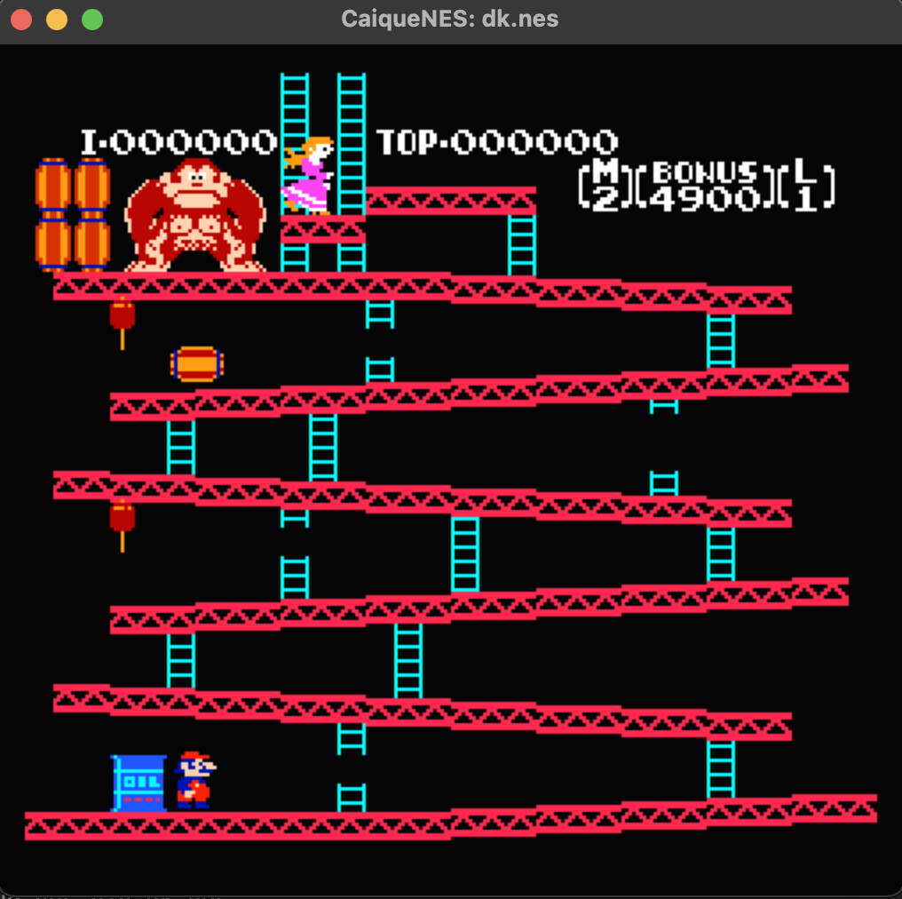
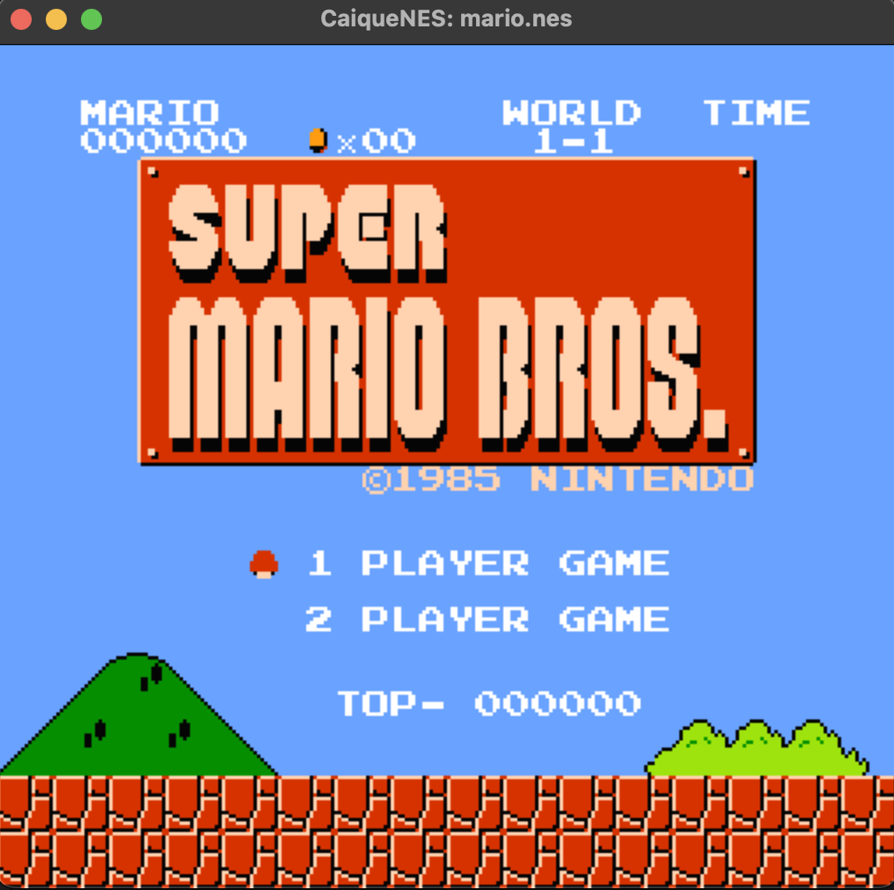
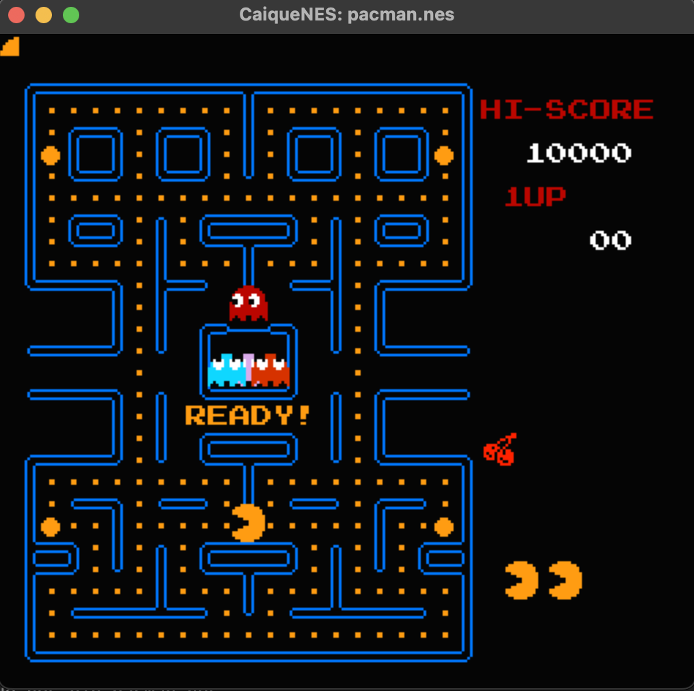

# CaiqueNES

Nintendo Entertainment System emulator.


<p float="left">



</p>

## Getting Started

### Dependencies

* C++ compiler with C++23 standard support.
* SDL2
* Qt6
* RapidJSON

### Compilation

1. Clone repository

```
git clone https://github.com/Zipeerix/caique-nes
```

2. Cd into the repository and create build folder

```
cd caique-nes
mkdir _Build
cd _Build
```

3. Run CMake

```
cmake ..
```

4. Run Make

```
make
```

### Launching Games

```
./caique-nes-bin <ROM_PATH>
```

## Compatibility & Features

#### CPU
- [X] Official instructions
- [X] Unofficial instructions (stable)
- [ ] Unofficial instructions (unstable)

#### MMU

- [X] NROM Mapper
- [ ] Other mappers

#### PPU

- [X] Background rendering
- [X] Sprites rendering
- [X] Palettes, colors etc
- [ ] Scrolling
- [ ] Non-zero nametables

#### Other

- [X] JoyPad
- [ ] APU
- [ ] Custom JoyPad settings
- [ ] Game selection from GUI

## Tests

All tests are automated using gtest.

- [X] NESTEST
- [X] Blargg Instruction Tests
- [X] 6502 JSON
- [ ] Blargg OAM

## License

This project is licensed under the Apache V2 License - see the LICENSE.md file for details
